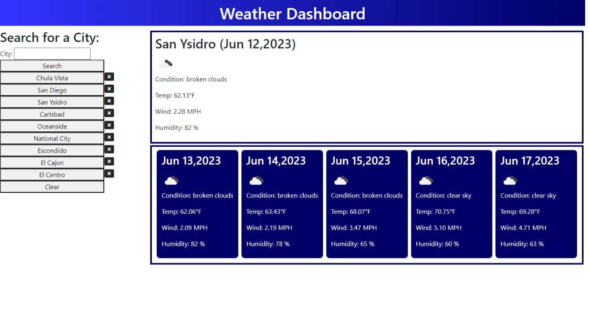

# Weather Dashboard
 Weather outlook for multiple cities

## Description
This site searches for the current 5-day weather forecast for a city, and saves up to 10 cities in case the user wants to search for them again.

## Usage
https://cleffy.github.io/WeatherDashboard/

The forecast area is originally blank until the user searches for a city.  
When the user searches for a city, it saves the query on their local storage. It searches Bing Maps for the geolocation of the city, then it requests the weather information from Open Weather Map API. It displays today's weather and the 5-day forecast.  
The user can research a city by clicking the corresponding button.  
If the user clicks the X icon, it clears that city from history.  
If the user clicks the clear button, it clears the entire history.

## Known Issues
Since this webpage does not have a backend, the API keys to use the services are exposed. Once the issue is resolved, the keys will be removed.

## Credits
Open Weather Map API - https://openweathermap.org/forecast5  
Bing Maps Locations API - https://learn.microsoft.com/en-us/bingmaps/rest-services/locations/  
Bootstrap - https://getbootstrap.com/  
Font Awesome - https://fontawesome.com/  
Day.js - https://day.js.org/  
W3Schools - https://www.w3schools.com/  
Mozilla Developer Resource - https://developer.mozilla.org/en-US/